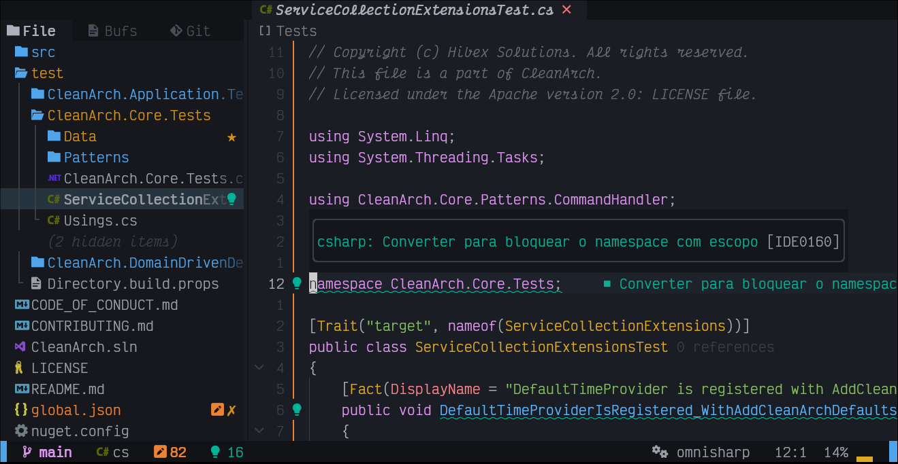

# AstroNvim do Erlimar

**NOTA:** Requer AstroNvim v4+



## 🛠️ Installation

#### Faça o backup de sua configuração nvim atual

```sh
# Shell
mv ~/.config/nvim ~/.config/nvim.bak
mv ~/.local/share/nvim ~/.local/share/nvim.bak
mv ~/.local/state/nvim ~/.local/state/nvim.bak
mv ~/.cache/nvim ~/.cache/nvim.bak
```

```pwsh
# PowerShell
mv $env:LOCALAPPDATA\nvim $env:LOCALAPPDATA\nvim.bak
mv $env:LOCALAPPDATA\nvim-data $env:LOCALAPPDATA\nvim-data.bak
```

#### Clone este repositório

```sh
# Shell
git clone https://github.com/erlimar/AstroNvim ~/.config/nvim
```

```pwsh
# PowerShell
git clone https://github.com/erlimar/AstroNvim $env:LOCALAPPDATA/nvim
```

#### Inicie o Neovim

```sh
nvim
```
